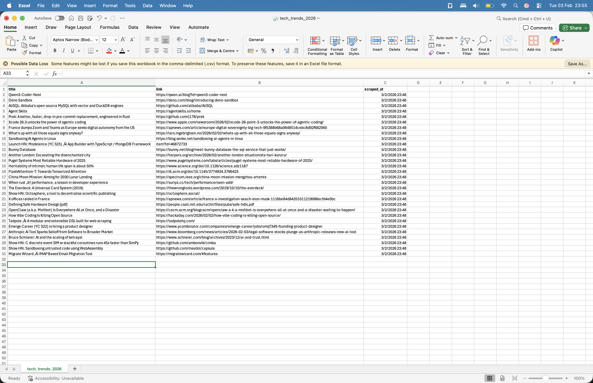

# Tech News Trend Scraper

A high-performance Python script designed to monitor the pulse of the technology industry. This tool automates the collection of top headlines from **Hacker News**, transforming unstructured web data into a structured format for market analysis and trend forecasting.

## Why This Project?
In a data-driven job market, being able to reliably extract and clean information is a critical skill. I built this tool to demonstrate:
* **Professional Extraction:** Using BeautifulSoup to traverse the DOM efficiently.
* **Ethical Scraping:** Implementing custom headers and rate-limits to respect server resources.
* **Data Persistence:** Automatically generating structured CSV files for downstream data analysis.

## Tech Stack & Tools
* **Language:** Python 3.10+
* **Libraries:** `requests`, `BeautifulSoup4`
* **Storage:** CSV (Standard Structured Format)

## Features
* **Live Scrape:** Pulls the current Top 30 stories from Hacker News.
* **Timestamped Data:** Every entry includes the exact time of extraction for historical trend tracking.
* **User-Agent Spoofing:** Mimics a modern browser to ensure reliable data retrieval.
* **Clean Exports:** Automatic CSV formatting, ready to be imported into Excel, Pandas, or SQL.

## Installation & Usage

### 1. Clone the repository
```bash
git clone https://github.com/RootedDreamsBlog/tech-news-scraper.git
cd tech-news-scraper
```

### 2. Create a virtual environment
#### MacOS/Linux
```bash
python3 -m venv venv
```
#### Windows
```bash
python -m venv venv
```

### 3. Activate the virtual environment
#### MacOS/Linux
```bash
source venv/bin/activate
```

#### Windows
```bash
.\venv\Scripts\activate
``
`
### 4. Install dependencies
```bash
pip install -r requirements.txt
```

### 5. Run the scraper
```bash
python scraper.py
```
## Preview
### Terminal Output


### Extracted Data (CSV)


## Contact
Built by **RootedDreamsBlog** (https://www.rooteddreams.net)

Disclaimer: This project is for educational purposes and respects the robots.txt guidelines of the target website.
